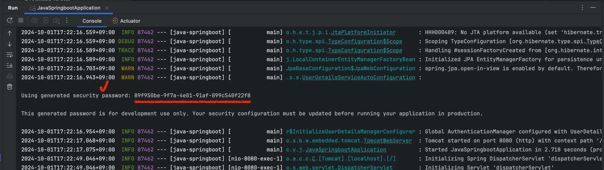

# Spring Security
- Spring Boot 3

## 프로젝트 설정
- Gradle 설정
```gradle
dependencies {
    ...
	// spring security
	implementation 'org.springframework.boot:spring-boot-starter-security'
	implementation 'org.springframework.boot:spring-boot-starter-webflux'

	testImplementation 'io.projectreactor:reactor-test'
	testImplementation 'org.springframework.security:spring-security-test'

	// Jwt
	implementation 'io.jsonwebtoken:jjwt-api:0.12.6'
	implementation 'io.jsonwebtoken:jjwt-impl:0.12.6'
	implementation 'io.jsonwebtoken:jjwt-jackson:0.12.6'
    ...
}
```

## Spring Security 설정

### 로그인 처리 방법
- 프로젝트 설정 후 바로 서버 실행시 로그인 화면 뜨며, 로그인 정보는 아이디 '**user**', 콘솔에 출력되는 **패스워드**를 입력하면 됨

ex)
- 로그인 화면

- 콘솔에 출력되는 패스워드


- application.properties에 아래 설정 추가시 콘솔 패스워드가 아닌 설정 정보로 로그인 가능
```yml
spring:
  security:
    user:
      name: admin
      password: admin
```

- 로그인 화면 미노출의 경우 아래 설정
    ```java
    # SecurityConfig.java

    @Configuration
    @EnableWebSecurity
    public class SecurityConfig {

        @Bean
        public SecurityFilterChain filterChain(HttpSecurity httpSecurity) throws Exception {

            httpSecurity.formLogin((form) -> form.disable());
            return httpSecurity.build();
        }
    }
    ```
