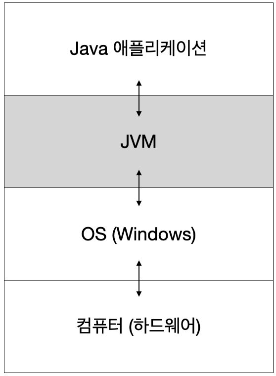
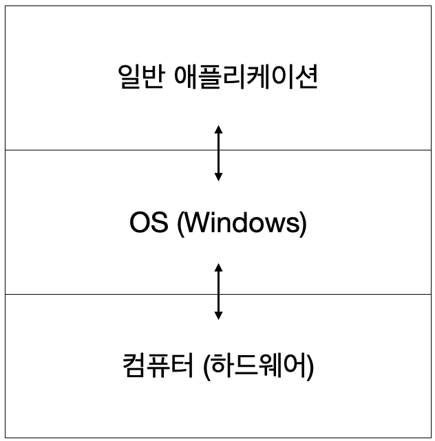

# Java
> 운영체제와 하드웨어에 관계없이 실행 가능

 자바 응용프로그램은 운영체제나 하드웨어가 아닌 자바가상머신(JVM) 하고만 통신하고 JVM이 자바 응용프로그램으로부터 전달받은 명령을 해당 운영체제가 이해할 수 있도록 변환하여 전달한다.  
  자바로 작성된 프로그램은 운영체제에 독립적이지만 JVM은 운영체제에 종속적이어서 썬에서는 여러 운영체제에 설치할 수 있는 서로 다른 버전의 JVM을 제공하고 있다.  

> 객체 지향적 언어

객체 지향 프로그래밍 언어(object-oriented programming language) 중 하나로 상속, 캡슐화, 다형성이 잘 적용된 순수한 객체지향적언어

> Garbage Collection (자동 메모리 관리)

 가비지 컬렉터(Garbage Collector)가 자동적으로 메모리를 관리해줌

 > 네트워크, 분산처리

 > 멀티 쓰레드

 > 동적 로딩 (Dynamic Loading)

 ## JVM (Java Virtual Machine)
JVM은 "**자바를 실행하기 위한 가상 기계(가상 컴퓨터)**"라고 함
-> 가상 컴퓨터 : 실제 컴퓨터(하드웨어)가 아닌 소프트웨어로 구현된 컴퓨터라는 뜻으로 컴퓨터 속의 컴퓨터

자바로 작성된 애플리케이션은 모두 이 가상 컴퓨터(JVM)에서만 실행되기 때문에 자바 애플리케이션 실행되기 위해서는 JVM이 반드시 필요함



> Java 애플리케이션과 일반 애플리케이션 (JVM 차이)

## JDK (Java Development Kit)
자바 프로그래밍시 JDK, JVM, Java API(자바 클래스 라이브러리) 설치 필요

### JDK / bin
javac.exe : 자바 컴파일러, 자바소스코드를 바이트 코드로 컴파일
java.exe : 자바 인터프리터, 컴파일러가 생성한 바이트코드를 해석하고 실행
javap.exe : 역어셈블러, 컴파일된 클래스파일을 원래의 소스로 변환

\* 바이트 코드 : JVM이 이해할 수 있는 기계어. JVM은 바이트코드를 해당 OS의 기계어로 변환하여 OS로 전달

javadoc.exe : 자동문서생성기. 소스파일에 있는 주석(/** */)을 이용하여 Java API문서와 같은 형식의 문서를 자동으로 생성
jar.exe : 압축프로그램, 클래스 파일과 프로그램의 실행에 관련된 파일을 하나의 jar파일(.jar)로 압축하거나 압축해제함

(+) JDK : 자바개발도구 (Java Development Kit)
JRE : 자바실행환경 (Java Runtime Encironment). 자바로 작성된 응용프로그램이 실행되기 위한 최소환경
JDK = JRE + 개발에 필요한 실행파일 (javac.exe)
JRE = JVM + 클래스라이브러리(Java API)

## java 실행
자바 파일 생성시 파일명과 클래스명이 완전히 일치해야함 (ex. Hello.java, Hello.class)
자바컴파일러(javac.exe)를 사용해서 소스파일(Hello.java)로 부터 클래스파일(Hello.java)을 생성해야한다. 그 다음에 자바 인터프리터(java.exe)로 실행한다.

```
Hello.java -(javac.exe 컴파일)-> Hello.class -(java.exe 실행)-> "Hello, World" 출력
```

```java
class 클래스 이름 {
    public static void main(String[] args) {
        // code
    }
}
```

> 모든 클래스가 메인 메서드를 가져야 하는것은 아니지만, 메인 메서드는 자바 애플리케이션의 시작점으로 메인 메서드 없이는 자바 애플리케이션은 실행될 수 없다. java.exe 다음에 main 메서드를 포함한 클래스의 이름을 적어야 한다.

(+) 소스 파일의 이름은 public class 이름과 일치해야 한다. public class가 없는 경우, 클래스 이름은 자유롭게 사용 가능


```bash
$ > java hello
```

> 실행 순서
>
> 1) 프로그램의 실행에 필요한 클래스(*.class)를 로드
> 2) 클래스 파일을 검사 (파일 형식, 악성코드 체크)
> 3) 지정된 클래스(Hello)에서 main(String[] args)를 호출
