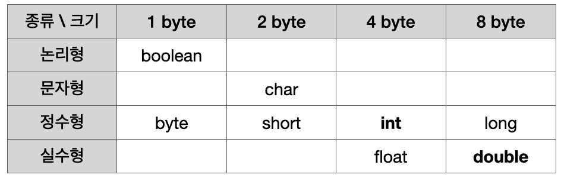
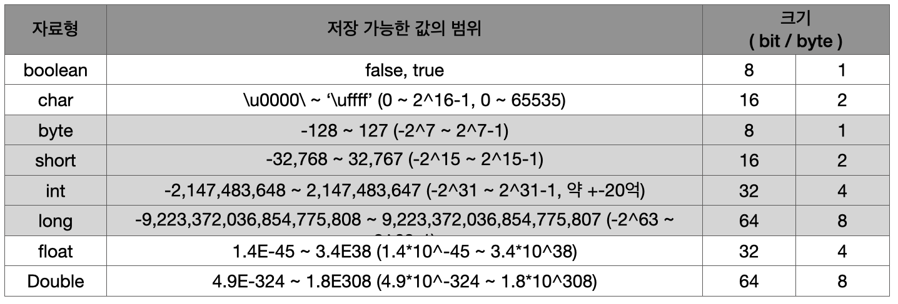
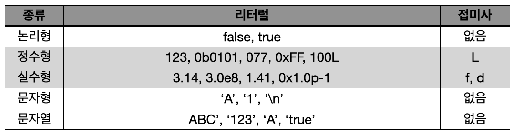

# Variable ( 변수 )
> 변수란, 단 하나의 값을 저장할 수 있는 메모리 공간

\* 변수 선언 : 메모리의 빈 공간에 '변수 타입'에 알맞은 크기의 저장공간이 확보되고, 이 저장공간은 '변수 이름'을 통해 사용할 수 있게 됨.

(+) 변수 타입 : 정수형, 실수형, 문자형 등.

\* 변수 초기화 : 변수를 사용하기 전에 처음으로 값을 저장하는 것

- 변수에 값을 저장할 때 "=" 연산자 이용
```java
// 1)
int a;
int b;
int x = 0;
int y = 0;

// 2)
int a, b;
int x = 0, y = 0;
```
> `1)`과 `2)`는 같은 의미의 다른 코드로, 타입이 같은 경우 ',(콤마)' 를 이용하여 변수를 한 줄에 선언하기도 함

## 변수 명명 규칙
'변수의 이름' 과 같이 프로그래밍에서 사용하는 모든 이름을 "**식별자(identifier)**"라고 함

식별자 규칙
```
- 대소문자가 구분되며 길이에 제한이 없다.
- 예약어는 사용해서는 안된다. (ex. true ..)
- 숫자로 시작해서는 안된다.
- 특수문자는 '_'와 '$'만 허용된다.
```

(+) 자바의 예약어
```
abstract assert
boolean break byte
case catch char class const continue
default do double
else enum extends
false final finally float for
if
goto
implements import instanceof int interface
long
native new null
package private protected public
return
short static strictfp super switch synchronized
this throw throws transient true try
void volatile
while
```

(+) 자바 권장 규칙 ?
- 클래스 이름의 첫 글자는 대문자로
- camelCase 사용
- 상수의 이름은 모두 대문자, snake_case

## 변수 타입
- 기본형(primitive type) : 실제 값(data)를 저장
    - **논리형(boolean), 문자형(char), 정수형(byte, short, int, long), 실수형(float, double)** 계산을 위한 실제 값을 저장
- 참조형(reference type) : 객체의 주소를 저장
    - **class, interface, array** 기본형을 제외한 나머지 타입

(+) 자료형(data type)과 타입(type)은 다름. 타입이 보다 넓은 의미 (타입은 참조형을 모두 포함하며, 자료형은 참조형과 구분됨)

## 기본형 (primitive type)
: 모두 8개의 타입. 크게 **논리형, 문자형, 정수형, 실수형**으로 구분

### 논리형 (boolean)
- true와 false 중 하나를 값으로 가지며, 조건식과 논리적 계산에 사용

### 문자형 (char; character)
- 문자를 저장하는데 사용되며, 변수에 하나의 문자만 저장할 수 있다.

### 정수형 (byte, short, int, long)
- 정수를 저장하는데 사용되며, 주로 int가 사용됨. byte는 이진 데이터를 다룰때 사용되며, short은 C언어와의 호환을 위해 추가됨
- int는 CPU가 가장 효율적으로 처리할 수 있는 타입이며, 효율적인 실행보다 메모리를 절약하려면 byte나 short 선택

### 실수형 (float, double)
- 실수를 저장하는데 사용되며, 주로 double이 사용됨

(+) 기본형의 종류와 크기

> boolean은 true, false 두 가지만 표현하면 되므로 가장 작은 크기인 1 byte  
> char는 자바에서 유니코드(2 byte 문자체계)를 사용하므로 2 byte  
> byte는 크기가 1 byte  
> int(4 byte)를 기준으로 짧아서 short(2 byte), 길어서 long(8 byte)  
> float은 실수값을 부동소수점(floating-point)방식으로 저장  
> double은 float보다 두 배의 크기(8 byte)를 갖기 때문에 double
>
> 1 byte = 8 bit

(+) 기본형의 크기와 범위

> float과 double은 양의 범위만 표기 (음의 범위는 양의 범위에 음수 부호 붙이면 됨)

(+) 정밀도 (precision) : 실수형은 정수형과 저장방식이 달라서 같은 크기라도 훨씬 큰 값을 표현할 수 있으나, 오차가 발생할 수 있다는 단점이 있음  
float의 정밀도는 7자리, double의 정밀도는 15자리로 float은 10진수로 7자리의 수를 오차없이 저장할 수 있다는 뜻

## 상수와 리터럴 (constant & literal)

### 상수 (constant)
: 변수와 마찬가지로 **값을 저장할 수 있는 공간**이지만, 변수와 달리 한번 값을 저장하면 다른 값으로 변경할 수 없다. 상수를 선언하는 방법은 변수와 동일하며, 변수의 타입 앞에 "**final**"을 붙여주기만 하면 되다. 상수의 이름은 모두 대문자로 하는 것이 암묵적인 관럐이며, snake case 로 작성한다.
```java
// 상수 MAX_SPEED 선언 & 초기화
final int MAX_SPEED = 10;
```
> 상수는 반드시 **선언과 동시에 초기화** 해야하며, 상수의 값을 **변경하는 것은 허용되지 않음**

### 리터럴 (literal)
: 상수는 값을 한 번 저장하면 변경할 수 없는 저장공간으로 정의하였기 때문에, 이와 구분하기 위해 리터럴을 사용한다.
```
변수 (variable) : 하나의 값을 저장하기 위한 공간
상수 (constant) : 값을 한번만 저장할 수 있는 공간
리터럴 (literal) : 그 자체로 값을 의미하는 것
```
```java
// year : 변수, 2014 : 리터럴
int year = 2014;
// MAX_VALUE : 상수, 100 : 리터럴
final int MAX_VALUE = 100;
```
#### 리터럴 타입과 접미사
: 변수에 타입이 있는 것처럼 리터럴에도 타입이 있다. 변수의 타입은 저장될 '값의 타입(리터럴의 타입)'에 의해 결정되므로, 리터럴에 타입이 없다면 변수의 타입도 필요없을 것이다.


- 정수형과 실수형에는 여러 타입이 존재하므로, 리터럴에 접미사를 붙여서 타입을 구분한다.
- 정수형 : long타입의 리터럴에는 접미사 'l' 혹은 'L' 을 붙이고, 접미사가 없으면 int타입의 리터럴이다.
- byte와 short타입의 리터럴은 별도로 존재하지 않아 변수에 값 저장시 int타입의 리터럴을 사용한다.
- 10진수 외에도 2, 8, 16진수로 표현된 러터럴을 변수에 저장할 수 있으며, 16진수는 접두사로 '0x' 또는 '0X'를, 8진수는 '0'을 붙인다. `1)`
- 정수형 리터럴의 중간에 구분자 '_'를 넣을 수 있다. `2)`
- 실수형 : float타입의 리터럴에 접미사 'f' 또는 'F'를 붙이고, double타입의 리터럴에는 'd' 또는 'D'를 붙인다. `3)`
- 정수형은 int가 기본 자료형인 것처럼, 실수형은 double이 기본 자료형이라서 접미사 'd(D)' 생략이 가능하다. `4)`
```java
// 1)
int octNum = 010; // 8진수 10 (8)
int hexNum = 0x10; // 16진수 10 (16)
int binNum = 0b10l // 2진수 10 (2)
// 2)
long big = 100_000_000_000L;
long hex = 0xFFFF_FFFF_FFFF_FFFFL;
// 3)
float pi = 3.14f; // 3.14F
double rate = 1.618d; // 1.618D
// 4)
float pi = 3.14; // 접미사 생략시 double타입으로 float에 지정 불가 (에러 발생)
double rate = 1.618; // 접미사 생략된 double.
```

### 타입 불일치
: 리터럴의 타입은 저장될 변수의 타입과 일치하는 것이 보통이지만, 타입이 달라도 저장범위가 넓은 타입에 좁은타입의 값을 저장하는 것은 허용된다.
```java
int i = 'A'; // 문자'A'의 유니코드인 65가 변수 i에 저장된다.
long l = 123; // int보다 long타입이 더 범위가 넓다.
double d = 3.14f; // float보다 double타입이 더 범위가 넓다.
```
- byte와 short타입의 리터럴은 따로 존재하지 않으므로 int타입의 리터럴을 사용한다. 단, short타입의 변수가 저장할 수 있는 범위에 속한 것이어야 한다.
```java
byte b = 65; // byte타입에 저장 가능한 범위의 int타입 리터럴
short s = 0x1234; // short타입에 저장 가능한 범위의 int타입 리터럴
```
### 문자 리터럴, 문자열 리터럴
: 'A'와 같이 작은따옴표로 문자 하나를 감싼 것을 '문자 리터럴'(char)이라고 한다. 두 문자 이상은 큰 따옴표로 감싸야 하며 '문자열 리터럴'(string)이라고 한다.
```java
char ch = 'J';
String name = "Java";
```
- char타입의 변수는 단 하나의 문자만 저장할 수 있으므로, 여러 문자(문자열)을 저장하기 위해서는 String타입을 사용해야 한다.
- 문자열 리터럴은 ""안에 아무런 문자도 넣지 않는 것을 허용하며, 이를 빈 문자열(empty string)이라고 한다. 그러나 문자 리터럴은 ''안에 하나의 문자가 있어야 한다.
```java
String str = ""; // 내용이 없는 빈 문자열
char ch = ''; // 에러 발생 ''안에 반드시 하나의 문자가 필요
char ch = ' '; // 공백 문자(blank)로 변수 ch를 초기화
```
- String은 클래스이므로 객체를 생성하는 연산자 new를 사용해야 하지만 예외 표현도 있다.
```java
String name = new String("Java"); // String객체를 생성
```
- "+" 덧셈 연산자 사용 가능
```java
String name = "Ja" + "va"; // Java
String str = name + 8.0 // Java8.0
```
> 문자열 + **any type** = 문자열 + **문자열** => 문자열  
> **any type** + 문자열 = **문자열** + 문자열 => 문자열
